# 📊 Análise Comparativa de Vendas: Excel e Power BI

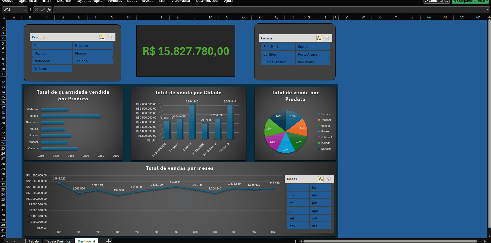

#### 📈 Projeto de análise de dados de uma farmácia fictícia
Este projeto demonstra um pipeline completo, desde o começo da extração de dados até os dashboards finais. 
Recebi duas bases de dados sujas, no qual elas se relacionavam. Uma "customers" e outras "orders".

Caso você queira ver todo o processo e as ferramentas que utilizei (Pandas, SQL, Excel e Power BI), é só clicar nos tópicos abaixo:

🔍 1. Verificando os dados

#### Primeiro comecei analisando a base de dados, percebi que nela haviam datas nulas, quantidades negativas, nomes de cidades que não batiam e alguns outros dados que precisam ser tratados
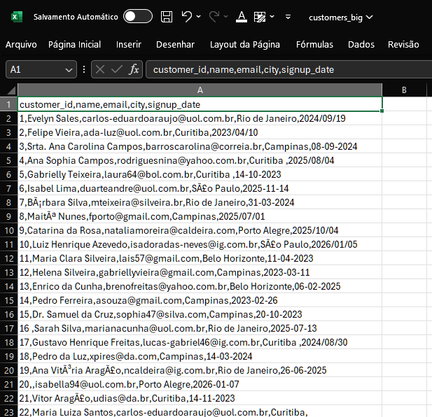
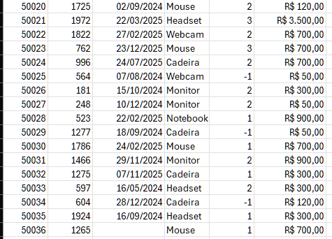

🧹 2. Começando a limpar

#### Utilizei Python com Pandas para fazer a limpeza de alguns dados irregulares, comecei deixando as quantidades positivas e preenchi posteriormente os dados que estavam nulos

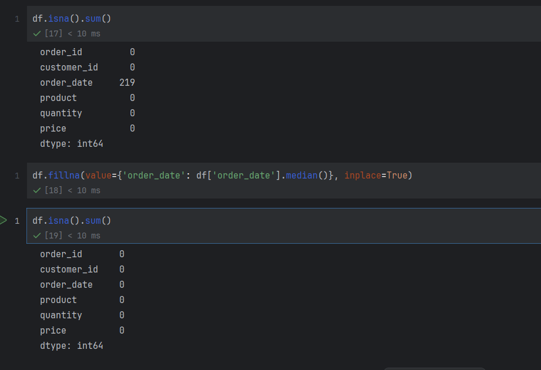
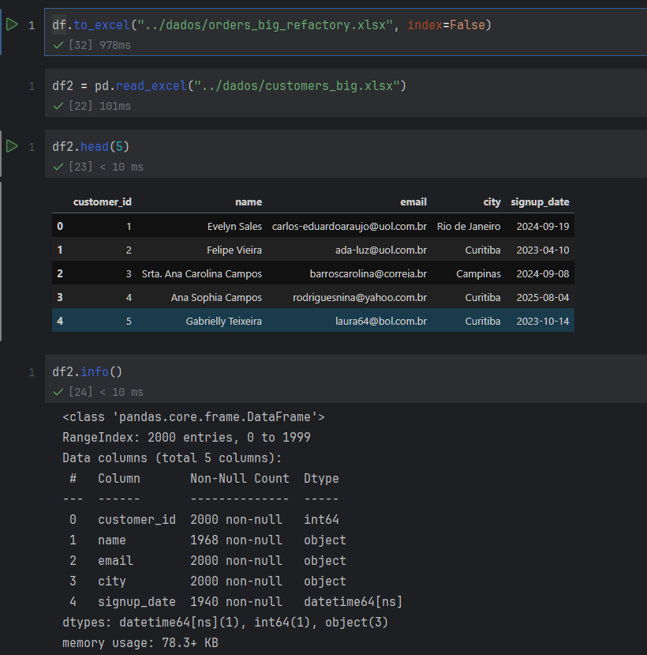
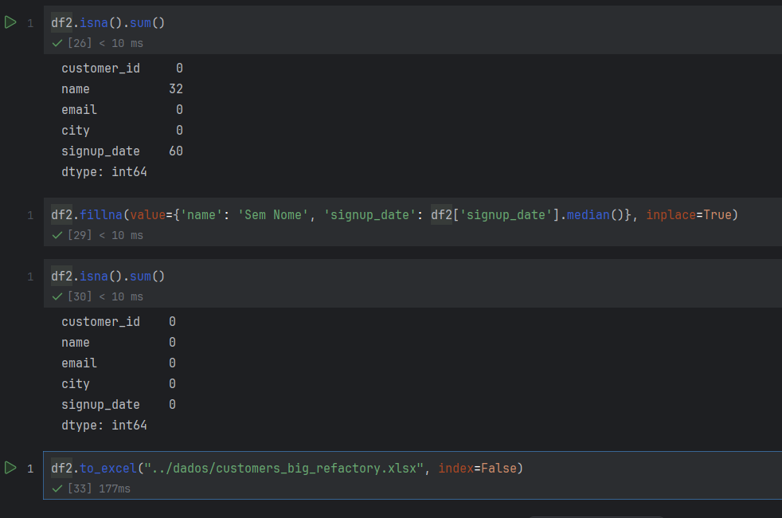

🗄️ 3. Consulta SQL

#### Após tratar alguns dados, fui fazer a consulta, nela eu juntei as duas tabelas com o relacionamento e procurei somente as vendas feitas a partir de 2024. Depois disso salvei como tabela_final em .xlsx
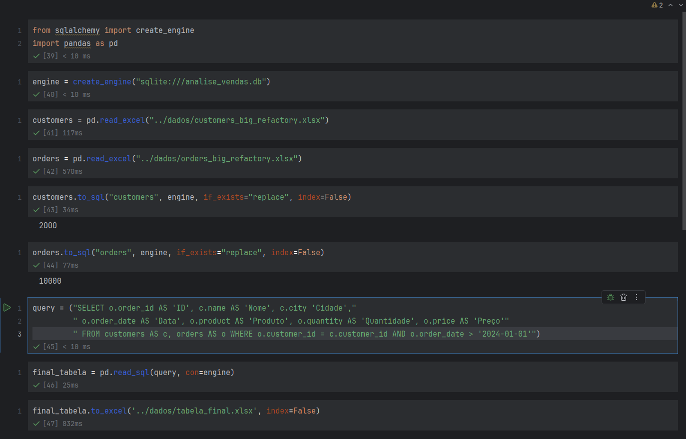

⚙️ 4. Terminando limpeza (Power Query)

#### Fui e enviei o arquivo tabela_final para o Power Query, e lá eu terminei de tratar alguns dos dados sujos que faltaram, como nomes de cidades irregulares 'São Paulo' e 'sao paulo', 'Curitiba ' e 'Curitiba', e mais alguns ajustes
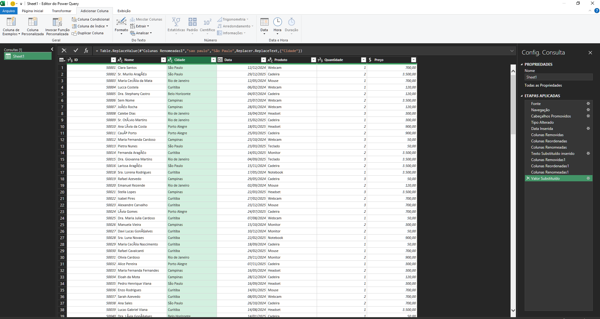

📉 5. Excel

#### Após ter todos os dados tratados, fui para o Excel, lá eu criei uma nova tabela 'Total', criei algumas tabelas dinâmicas e um dashboard contendo as principais informações
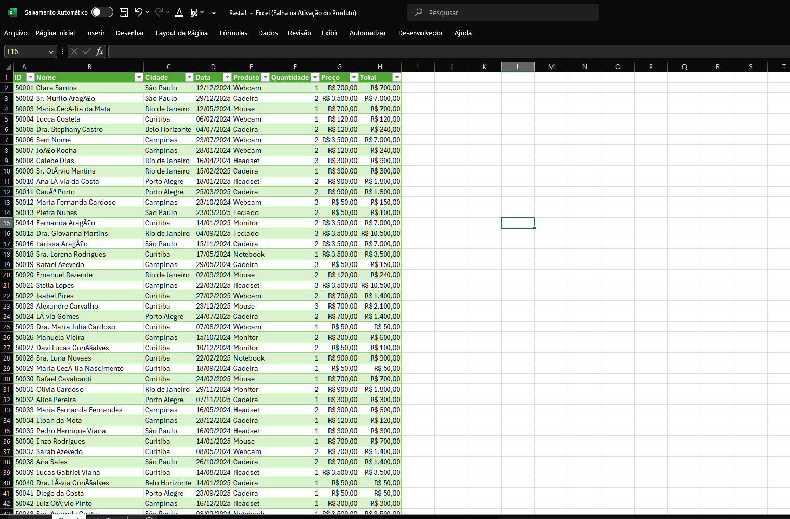
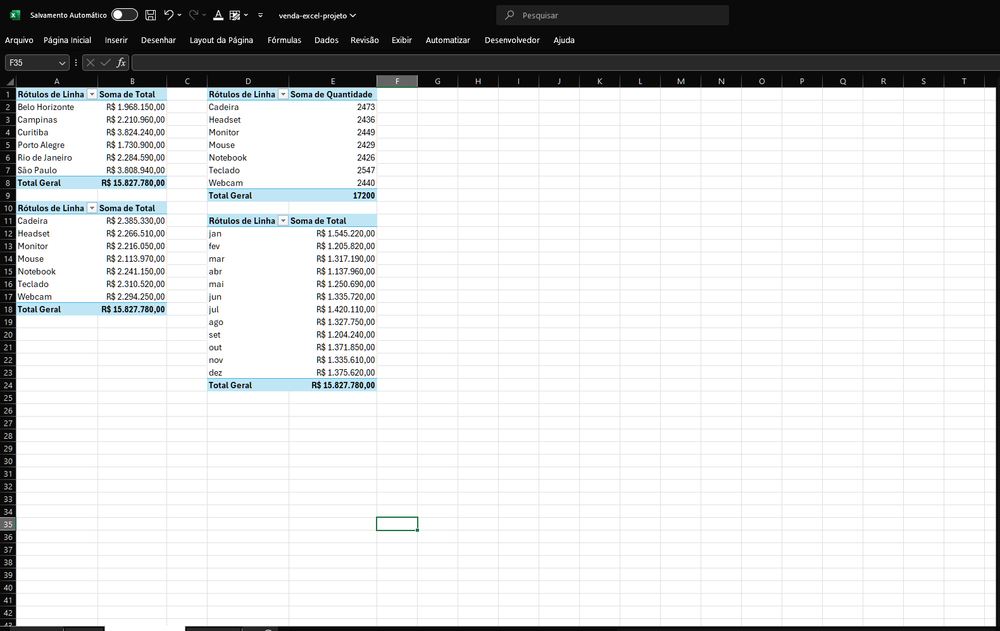
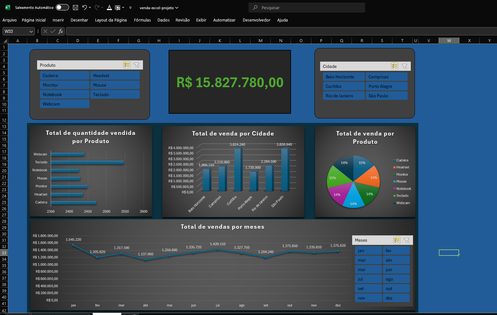

💎 6. Power BI

#### E por final, fui para o Power BI para criar um último gráfico e criei alguns DAX essenciais para o projeto
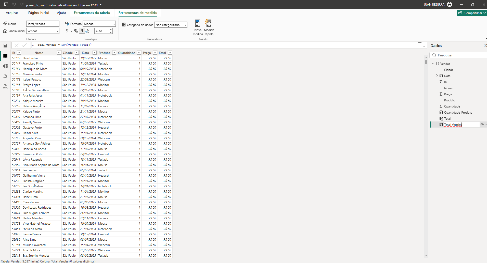
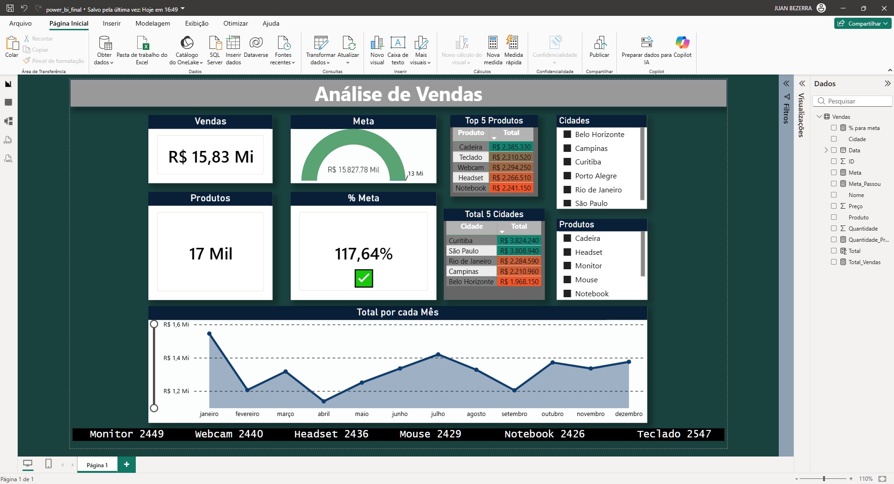

## 📂 Download dos Arquivos

 - **Dashboard Power BI** | Arquivo .pbix com as análises e DAX | [Baixar](files/power_bi.pbix) | 

- **Planilha Final Excel** | Dados tratados e Tabelas Dinâmicas | [Baixar](files/venda-excel-projeto.xlsx) |

- **Bases de Dados 1** | Arquivo order sem nenhum tratamento | [Baixar](files/orders_big.xlsx) |

- **Bases de Dados 2** | Arquivo customers sem nenhum tratamento | [Baixar](files/customers_big.xlsx) |

